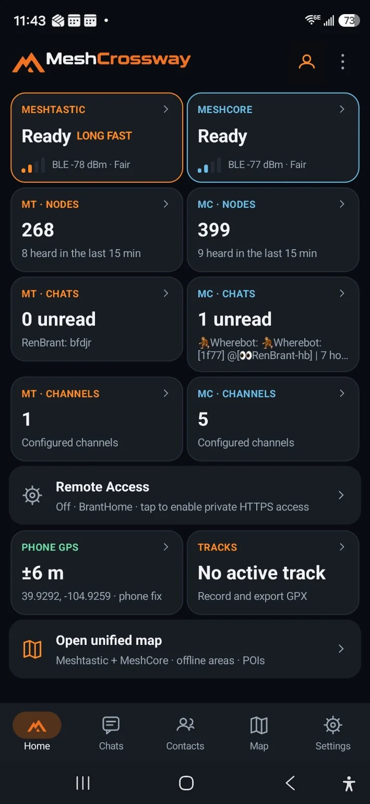
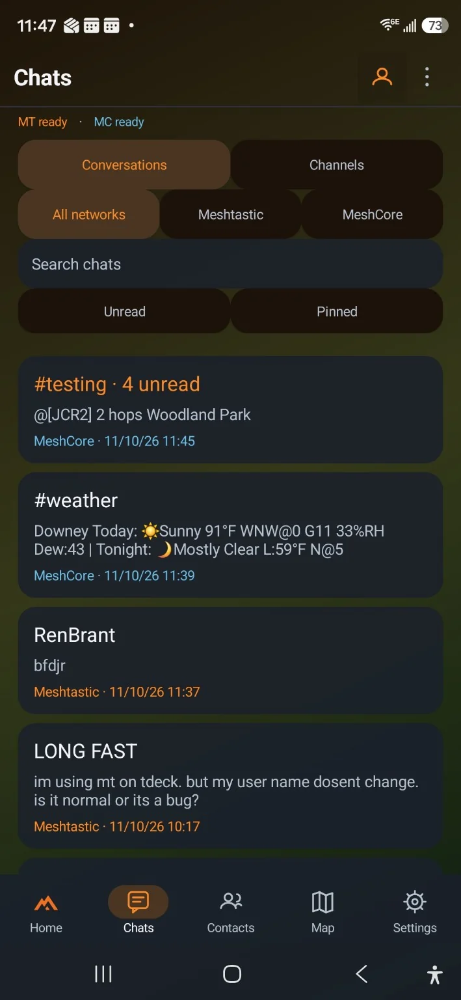
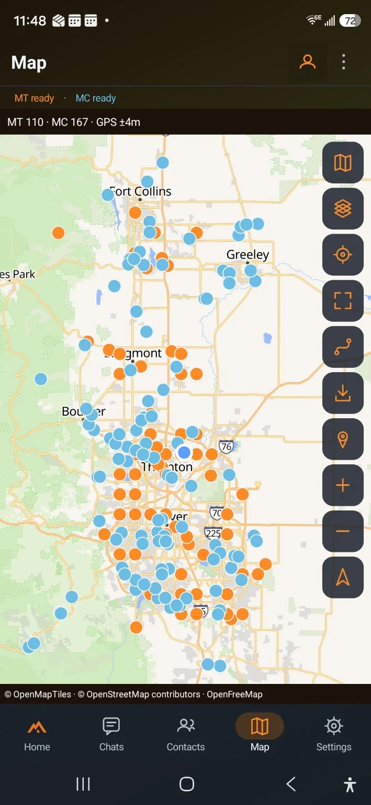

# MeshCrossway for Android

**Two networks. Two radios. One app.** Use Meshtastic and MeshCore together on your Android phone, with messages, contacts and a shared map in one place.

Connect **two independent Bluetooth radios**: one running Meshtastic and one running MeshCore Companion BLE firmware. Each keeps its own network and conversations. MeshCrossway does not forward messages between the networks.

**[Download Android 0.4.8 beta](https://github.com/Renbrant/MeshCrossway/releases/download/android-v0.4.8/MeshCrossway-0.4.8.apk)** · [Visit the website](https://meshcrossway.renbrant.com/) · [Installation help](https://meshcrossway.renbrant.com/android/)

> Public beta for testing. Android 8.0+ on ARM64. Version 1.0 has not been released; compatibility and field testing continue.

  

Screenshots from beta 0.3.6; the current app may look different.

## What you can do

- Keep chats, channels, contacts and favorites from both networks together.
- Create and join channels, including sharing links and QR Codes.
- See nodes on one map, save places, record tracks and export GPX files.
- Download map areas before going offline.
- Follow your phone on the map, with an arrow showing your direction while moving.
- Customize colors, back up your data and use optional account and browser tools.
- Inspect and configure compatible MeshCore repeaters with administrator access.

Radio messages and saved offline maps work without cellular service. Internet is needed for app/map downloads and cloud features. Delivery depends on your radios, terrain and available mesh coverage.

## Get started

1. Download and open the APK on your Android phone. Allow installation when Android asks.
2. In Settings, connect your Meshtastic radio and your separate MeshCore radio. Close other apps connected to those radios first.
3. Wait for both networks to be ready, then open Chats or Map.

You choose and provide the radios. Heltec V3 radios are used in development; other models and firmware combinations need testing. A dedicated touchscreen controller is not required.

**Already using MeshCrossway?** Back up important data, then install the update over your existing app. **Do not uninstall or clear storage.** Versions 0.2.2 and earlier need the [one-time migration guide](docs/android-permanent-signing-backup.md).

## Latest improvements

**0.4.8 beta** adds GPS following and a movement arrow, building on simpler MeshCore repeater settings and protocol compatibility fixes. Map gestures pause following; tap GPS to resume. New behavior still needs field testing across supported setups. See the [release notes](https://github.com/Renbrant/MeshCrossway/releases/tag/android-v0.4.8).

## Guides and project information

- [Installation, compatibility and troubleshooting](docs/android-apk.md)
- [Channels, links and QR Codes](docs/android-channel-management.md)
- [Release history and version numbering](docs/android-version-history.md)
- [Android source and development guide](android/README.md)
- [ESP32 controller project and Web Flasher](https://meshcrossway.renbrant.com/esp32/) — secondary development track; stable firmware v0.10.5

## Contributing and license

Feedback, testing and contributions are welcome. [Report a problem](https://github.com/Renbrant/MeshCrossway/issues) with your app version, phone and radio models, or read [CONTRIBUTING.md](CONTRIBUTING.md).

Original project code and documentation use the [MIT License](LICENSE); see [licensing](docs/licensing.md) and [third-party notices](THIRD_PARTY_NOTICES.md). MeshCrossway is experimental and should not be your only means of communication in an emergency.
